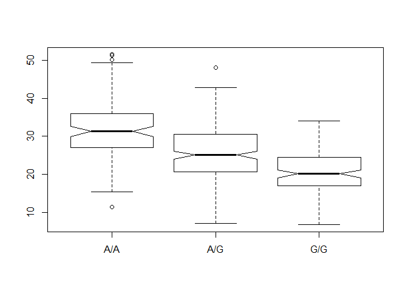

Class13
================

Ensemble
========

``` r
mxl <-  read.csv(file ="373531-SampleGenotypes-Homo_sapiens_Variation_Sample_rs8067378.csv")
head(mxl)
```

    ##   Sample..Male.Female.Unknown. Genotype..forward.strand. Population.s.
    ## 1                  NA19648 (F)                       A|A ALL, AMR, MXL
    ## 2                  NA19649 (M)                       G|G ALL, AMR, MXL
    ## 3                  NA19651 (F)                       A|A ALL, AMR, MXL
    ## 4                  NA19652 (M)                       G|G ALL, AMR, MXL
    ## 5                  NA19654 (F)                       G|G ALL, AMR, MXL
    ## 6                  NA19655 (M)                       A|G ALL, AMR, MXL
    ##   Father Mother
    ## 1      -      -
    ## 2      -      -
    ## 3      -      -
    ## 4      -      -
    ## 5      -      -
    ## 6      -      -

``` r
table(mxl$Genotype..forward.strand.)
```

    ## 
    ## A|A A|G G|A G|G 
    ##  22  21  12   9

Proportion of MXL with G|G genotype

``` r
table(mxl$Genotype..forward.strand.)/nrow(mxl)*100
```

    ## 
    ##     A|A     A|G     G|A     G|G 
    ## 34.3750 32.8125 18.7500 14.0625

``` r
library(seqinr)
library(gtools)
phred <- asc( s2c("DDDDCDEDCDDDDBBDDDCC@") ) - 33
phred
```

    ##  D  D  D  D  C  D  E  D  C  D  D  D  D  B  B  D  D  D  C  C  @ 
    ## 35 35 35 35 34 35 36 35 34 35 35 35 35 33 33 35 35 35 34 34 31

``` r
hits <- read.table("rs8067378_ENSG00000172057.6.txt")

summary(hits)
```

    ##      sample     geno          exp        
    ##  HG00096:  1   A/A:108   Min.   : 6.675  
    ##  HG00097:  1   A/G:233   1st Qu.:20.004  
    ##  HG00099:  1   G/G:121   Median :25.116  
    ##  HG00100:  1             Mean   :25.640  
    ##  HG00101:  1             3rd Qu.:30.779  
    ##  HG00102:  1             Max.   :51.518  
    ##  (Other):456

``` r
table(hits$geno)
```

    ## 
    ## A/A A/G G/G 
    ## 108 233 121

``` r
ind <- (hits$geno == "G/G")

summary(hits[ind,])
```

    ##      sample     geno          exp        
    ##  HG00099:  1   A/A:  0   Min.   : 6.675  
    ##  HG00109:  1   A/G:  0   1st Qu.:16.903  
    ##  HG00112:  1   G/G:121   Median :20.074  
    ##  HG00116:  1             Mean   :20.594  
    ##  HG00118:  1             3rd Qu.:24.457  
    ##  HG00120:  1             Max.   :33.956  
    ##  (Other):115

``` r
indaa <- (hits$geno == "A/A")

indag <- hits$geno == "A/G"

summary(hits[indaa,])
```

    ##      sample     geno          exp       
    ##  HG00096:  1   A/A:108   Min.   :11.40  
    ##  HG00100:  1   A/G:  0   1st Qu.:27.02  
    ##  HG00101:  1   G/G:  0   Median :31.25  
    ##  HG00102:  1             Mean   :31.82  
    ##  HG00104:  1             3rd Qu.:35.92  
    ##  HG00105:  1             Max.   :51.52  
    ##  (Other):102

``` r
summary(hits[indag,])
```

    ##      sample     geno          exp        
    ##  HG00097:  1   A/A:  0   Min.   : 7.075  
    ##  HG00103:  1   A/G:233   1st Qu.:20.626  
    ##  HG00106:  1   G/G:  0   Median :25.065  
    ##  HG00110:  1             Mean   :25.397  
    ##  HG00114:  1             3rd Qu.:30.552  
    ##  HG00115:  1             Max.   :48.034  
    ##  (Other):227

``` r
boxplot(hits$exp ~ hits$geno, notch=TRUE)
```


