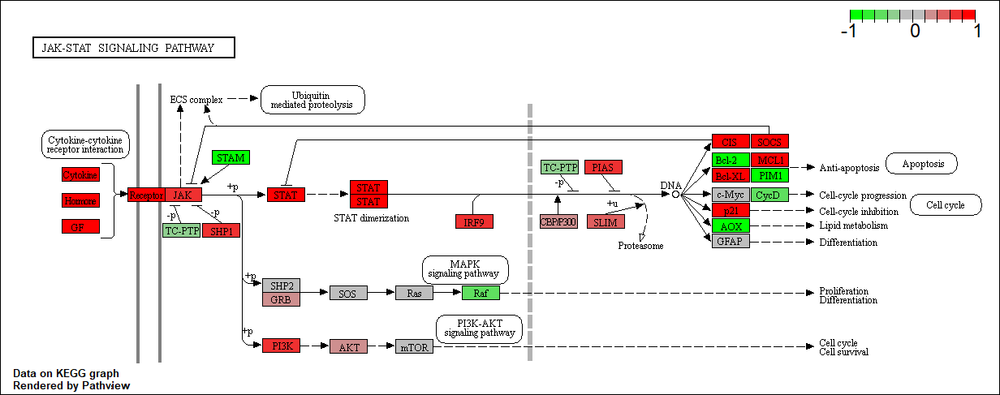

```{r setup, include=FALSE}
knitr::opts_chunk$set(echo = TRUE)
```

#Section 1: Differential Expression Analyis
```{r}
library(DESeq2)
metaFile <- "GSE37704_metadata.csv"
countFile <- "GSE37704_featurecounts.csv"


# Import metadata and take a peak
colData = read.csv(metaFile, row.names=1)
head(colData)
```
```{r}
# Import countdata
countData = read.csv(countFile, row.names=1)
head(countData)
```

```{r}
countData <- as.matrix(countData[,-1])
head(countData)
```

```{r}
countData <- countData[rowSums(countData)!=0,]
head(countData)
```
#Running DEseq2
```{r}
dds = DESeqDataSetFromMatrix(countData=countData,
                             colData=colData,
                             design=~condition)
dds = DESeq(dds)
```
```{r}
dds

```

```{r}
resultsNames(dds)
res <- results(dds)
```

```{r}
summary(res)
```

##Volcano Plot of Results
```{r}
plot( res$log2FoldChange, -log(res$padj) )

```
#Coloring my Volcano Plot
```{r}
my.cols <- rep("gray", nrow(res))
my.cols[abs(res$log2FoldChange)>2] <- "red"
inds <- (res$padj<0.01) & (abs(res$log2FoldChange)>2)
my.cols[inds] <- "blue"
```


```{r}
plot( res$log2FoldChange, -log(res$padj), col=my.cols )

plot( res$log2FoldChange, -log(res$padj), col=my.cols, xlab="Log2(FoldChange)", ylab="-Log(P-value)" )
abline(h=0.01,v=c(-2,2), lty=2)
```

##Adding Gene Annotation
```{r}
library("AnnotationDbi")
library("org.Hs.eg.db")

columns(org.Hs.eg.db)

res$symbol = mapIds(org.Hs.eg.db,
                    keys=row.names(res), 
                    keytype="ENSEMBL",
                    column="SYMBOL",
                    multiVals="first")

res$entrez = mapIds(org.Hs.eg.db,
                    keys=row.names(res),
                    keytype="ENSEMBL",
                    column="ENTREZID",
                    multiVals="first")


res$name =   mapIds(org.Hs.eg.db,
                    keys=row.names(res),
                    keytype="ENSEMBL",
                    column="GENENAME",
                    multiVals="first")

head(res, 10)
```

##Rewriting results by adjusted p-value
```{r}
res = res[order(res$pvalue),]
write.csv(res,file="deseq_results.csv")
```

##Section 2:Pathway Analysis
```{r}
library(pathview)
```
```{r}
library(gage)
library(gageData)

data(kegg.sets.hs)
data(sigmet.idx.hs)

# Focus on signaling and metabolic pathways only
kegg.sets.hs = kegg.sets.hs[sigmet.idx.hs]

# Examine the first 3 pathways
head(kegg.sets.hs, 3)
```


```{r}
foldchanges = res$log2FoldChange
names(foldchanges) = res$entrez
head(foldchanges)
```


#Gage Pathway Analysis
```{r}
keggres = gage(foldchanges, gsets=kegg.sets.hs)
```

```{r}
attributes(keggres)
```

```{r}
# Look at the first few down (less) pathways
head(keggres$less)

```


```{r}
pathview(gene.data=foldchanges, pathway.id="hsa04110")
```

```{r}
# A different PDF based output of the same data
pathview(gene.data=foldchanges, pathway.id="hsa04110", kegg.native=FALSE)
```


```{r}
## Focus on top 5 upregulated pathways here for demo purposes only
keggrespathways <- rownames(keggres$greater)[1:5]

# Extract the 8 character long IDs part of each string
keggresids = substr(keggrespathways, start=1, stop=8)
keggresids
```

```{r}
pathview(gene.data=foldchanges, pathway.id=keggresids, species="hsa")

```




##Seciton 3. Gene Ontology (GO)
```{r}
data(go.sets.hs)
data(go.subs.hs)

# Focus on Biological Process subset of GO
gobpsets = go.sets.hs[go.subs.hs$BP]

gobpres = gage(foldchanges, gsets=gobpsets, same.dir=TRUE)

lapply(gobpres, head)
```
##Section 4. Reactome Analysis

```{r}
sig_genes <- res[res$padj <= 0.05 & !is.na(res$padj), "symbol"]
print(paste("Total number of significant genes:", length(sig_genes)))


```

```{r}
write.table(sig_genes, file="significant_genes.txt", row.names=FALSE, col.names=FALSE, quote=FALSE)

```


