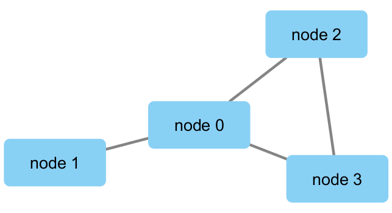
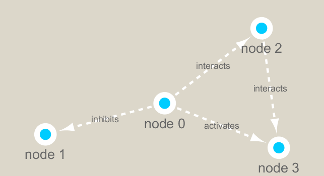

```{r setup, include=FALSE}
knitr::opts_chunk$set(echo = TRUE)
```

```{r}
library(RCy3)
library(igraph)
library(RColorBrewer)
```

```{r}
cytoscapePing()
```
```{r}
cytoscapeVersionInfo()
```
```{r}
g <- makeSimpleIgraph()
createNetworkFromIgraph(g, "myGraph")
```

```{r}
fig <- exportImage(filename="demo", type="png", height = 350)

```
#Switch Styles
```{r}
setVisualStyle("Marquee")
```
```{r}
fig <- exportImage(filename = "demo_marquee", type= "png", height=350)


```
```{r}
styles <- getVisualStyleNames()
styles
```
```{r}
setVisualStyle(styles[17])
```
```{r}
plot(g)
```
##Read our metagenomics data
```{r}
## scripts for processing located in "inst/data-raw/"
prok_vir_cor <- read.delim("./virus_prok_cor_abundant.tsv", stringsAsFactors = FALSE)

## Have a peak at the first 6 rows
head(prok_vir_cor)
```

```{r}
nrow(prok_vir_cor)
g <- graph.data.frame(prok_vir_cor, directed = F)
```

```{r}
class(g)
g

```

```{r}
plot(g)
plot(g, vertex.label=NA)
plot(g, vertex.size=3, vertex.label=NA)
```

##Network Querys
```{r}
V(g)
```
```{r}
E(g)
```
##Network Community Detection
```{r}
cb <- cluster_edge_betweenness(g)
cb
plot(cb, y=g, vertex.label=NA,  vertex.size=3)
```
```{r}
head(membership(cb))
```
##Node Degree
```{r}
# Calculate and plot node degree of our network
d <- degree(g)
hist(d, breaks=30, col="lightblue", main ="Node Degree Distribution")
```
```{r}
plot(degree_distribution(g), type="h")

```
##Centrality Analysis
```{r}
pr <- page_rank(g)
head(pr$vector)
```
```{r}
library(BBmisc)
```

```{r}
v.size <- BBmisc::normalize(pr$vector, range=c(2,20),method="range")
plot(g, vertex.size=v.size,vertex.label=NA)
```
```{r}
b <- betweenness(g)
v.size <- BBmisc::normalize(b, range=c(2,20), method="range")
plot(g, vertex.size=v.size, vertex.label=NA)

```


##Read taxonomic classification for network annotation

```{r}
phage_id_affiliation <- read.delim("phage_ids_with_affiliation.tsv")
head(phage_id_affiliation)
```
```{r}
bac_id_affi <- read.delim("prok_tax_from_silva.tsv", stringsAsFactors = FALSE)
head(bac_id_affi)
```
##Add taxonomic annotation data to network
```{r}
## Extract out our vertex names
genenet.nodes <- as.data.frame(vertex.attributes(g), stringsAsFactors=FALSE)
head(genenet.nodes)
```
```{r}
length( grep("^ph_",genenet.nodes[,1]) )
```
```{r}
# We dont need all annotation data so lets make a reduced table 'z' for merging
z <- bac_id_affi[,c("Accession_ID", "Kingdom", "Phylum", "Class")]
n <- merge(genenet.nodes, z, by.x="name", by.y="Accession_ID", all.x=TRUE)
head(n)
```
```{r}
colnames(n)
colnames(phage_id_affiliation)
```
```{r}
# Again we only need a subset of `phage_id_affiliation` for our purposes
y <- phage_id_affiliation[, c("first_sheet.Phage_id_network", "phage_affiliation","Tax_order", "Tax_subfamily")]

# Add the little phage annotation that we have
x <- merge(x=n, y=y, by.x="name", by.y="first_sheet.Phage_id_network", all.x=TRUE)

## Remove duplicates from multiple matches
x <- x[!duplicated( (x$name) ),]
head(x)
```

```{r}
genenet.nodes <- x
```
##Send network to Cytoscae using RCy3
```{r}
# Open a new connection and delete any existing windows/networks in Cy
deleteAllNetworks()
```

```{r}
# Set the main nodes colname to the required "id" 
colnames(genenet.nodes)[1] <- "id"
```

```{r}
genenet.edges <- data.frame(igraph::as_edgelist(g))

# Set the main edges colname to the required "source" and "target" 
colnames(genenet.edges) <- c("source","target")

# Add the weight from igraph to a new column...
genenet.edges$Weight <- igraph::edge_attr(g)$weight

# Send as a new network to Cytoscape
createNetworkFromDataFrames(genenet.nodes,genenet.edges, 
                            title="Tara_Oceans")
```

